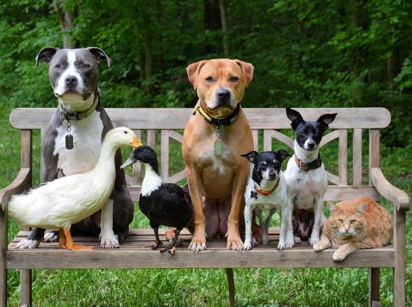
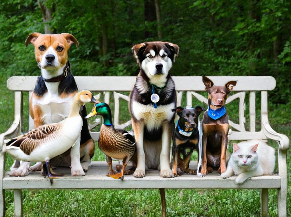
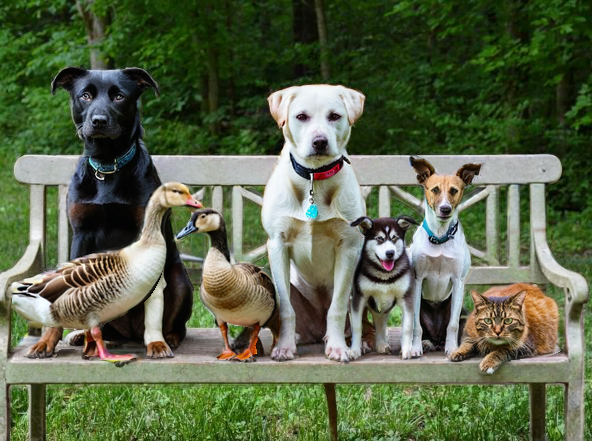

# Dataset Enhancement with Instance-Level Augmentations

[](https://arxiv.org/abs/2406.08249)

Instance Augmentation method augment images by redrawing individual objects in the scene retaining their original shape. This allows training with the unchanged class label (e.g. class, segmentation, detection, etc.). The generations are highly diverse and match the scene composition

Original             |  Augmented             |  Augmented
:-------------------------:|:-------------------------:|:-------------------------:
  |    |  

## Installation

The code uses **Python 3.8**.

#### Create a Conda virtual environment and Install The Package:

Make sure you have Conda installed.

```bash
make env
```

#### Run Test for the Package:

```bash
make pytest
```

#### Run on a folder of images:

An example is available in tests/test_pipeline.py - test_end_to_end

To predict instance masks:
```python
from instance_augmentation.pseudolabel_dataset import create_annotations

create_annotations("path_to_image_folder", "path_to_save_results", dataset_type="custom", class_names=["dog", "cat", "any_other_classes"])
```

To generate augmented images:
```python
from instance_augmentation.pipeline.dataset_generator import DatasetGenerator
from instance_augmentation.pipeline.readers import CustomDatasetReader

reader = CustomDatasetReader("path_to_image_folder", {}, "path_to_save_results/annotations.json")
dataset_generator = DatasetGenerator.from_params(
        dataset_reader=reader,
        save_folder="path_to_save_results",
        preprocessing="resize",
        target_image_size=1024,
        base_inpainting_model="SG161222/RealVisXL_V3.0",
        generator="inpaint_sdxl_adapter",
        num_samples=1,
        num_inference_steps=20,
        control_methods=["t2i_depth", "t2i_sketch"],
        control_weights=[0.9, 0.5],
    )
    dataset_generator.run()
```

To apply augmentations:
```python
import os
import cv2
import glob
from instance_augmentation.augment import Augmenter

augmenter = Augmenter("path_to_save_results", p=1.0)
for image_path in glob.glob("path_to_image_folder/*"):
    image_name = os.path.split(image_path)[1]
    original_image = cv2.cvtColor(cv2.imread(image_path), cv2.COLOR_BGR2RGB)
    augmented_image = augmenter.augment_image(original_image, image_name)

```
